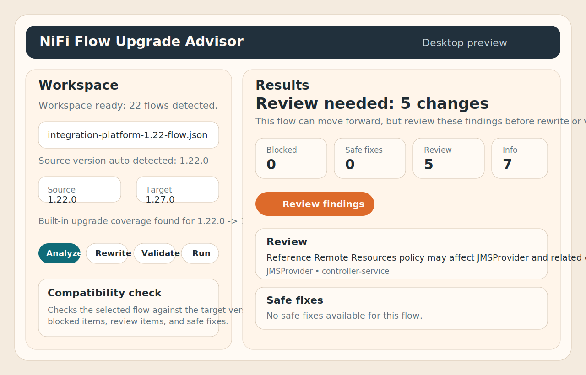
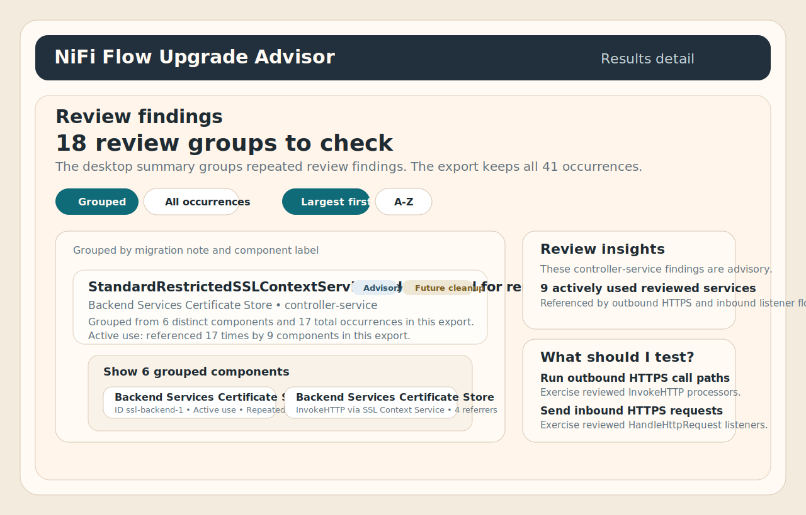

# nifi-flow-upgrade-advisor

`nifi-flow-upgrade-advisor` is a desktop-first Apache NiFi flow upgrade tool with a CLI engine underneath for automation.

It is intentionally separate from runtime platforms such as NiFi-Fabric. The job of this repo is to inspect a source flow artifact, compare it with a selected target NiFi version, explain what changed, apply only mechanically safe rewrites, and validate the result before publish.

The desktop app is now the easiest way to use the product. It gives teams a guided workspace scan, one-click `analyze`, `rewrite`, `validate`, and `run`, and clearer result views without replacing the underlying automation surface. The CLI remains the stable engine for CI, GitOps, and scripted workflows.





## Scope

Current commands:

- `analyze`
- `rewrite`
- `validate`
- `publish`
- `run`
- `rule-pack lint`
- `version`

Current source support:

- `flow.json.gz`
- versioned flow snapshots
- NiFi Registry export JSON
- Git-backed registry directories for analysis and rewrite
- legacy `flow.xml.gz` for analysis and validation

Current safety boundary:

- safe deterministic rewrites only
- no guessing through deprecated processors that require architecture decisions
- no secret recovery
- no in-cluster mutation

What `validate` covers now:

- target NiFi version checks via `/flow/about`
- target runtime extension inventory checks via `/flow/runtime-manifest`
- target process group readiness checks for pre-import or pre-update validation

What `publish` covers now:

- filesystem publish for rewritten artifacts and directories
- Git-backed registry layout publish for JSON-based snapshots and registry trees
- NiFi Registry version import for versioned flow snapshots and Registry export JSON

## Layout

- [`cmd/nifi-flow-upgrade`](cmd/nifi-flow-upgrade)
- [`internal/flowupgrade`](internal/flowupgrade)
- `desktop-app` for the Tauri desktop wrapper
- [`docs/design.md`](docs/design.md)
- [`docs/cli.md`](docs/cli.md)
- [`docs/rule-pack-format.md`](docs/rule-pack-format.md)
- [`docs/release-process.md`](docs/release-process.md)
- [`docs/secrets-and-parameters.md`](docs/secrets-and-parameters.md)
- [`docs/troubleshooting.md`](docs/troubleshooting.md)
- [`demo`](demo)
- [`examples/rulepacks`](examples/rulepacks)
- [`examples/manifests`](examples/manifests)

## Quick Start

### Desktop app first

Build and launch the desktop app:

```bash
cargo run --manifest-path desktop-app/src-tauri/Cargo.toml
```

Then:

1. scan your workspace
2. choose a flow
3. confirm source and target versions
4. click `Analyze`
5. click `Rewrite` only when safe fixes are available
6. click `Validate` or `Run` when you want target checks or the guided sequence

Desktop guide:

- [`docs/desktop-guide.md`](docs/desktop-guide.md)

### CLI and release install

Build:

```bash
go build ./cmd/nifi-flow-upgrade
```

Install from a release:

```bash
curl -fsSL https://raw.githubusercontent.com/michaelhutchings-napier/nifi-flow-upgrade-advisor/main/install.sh | bash
```

The desktop app is a thin Tauri wrapper around the same CLI. It can scan a workspace, detect likely flows and upgrade coverage, and run `analyze`, `rewrite`, `validate`, and `run` without creating a second migration engine.

Advanced CLI example:

```bash
./nifi-flow-upgrade analyze \
  --source ./fixtures/source/flow.json.gz \
  --source-format flow-json-gz \
  --source-version 1.27.0 \
  --target-version 2.0.0 \
  --rule-pack ./examples/rulepacks/nifi-1.27-to-2.0.official.yaml \
  --output-dir ./out
```

Rewrite:

```bash
./nifi-flow-upgrade rewrite \
  --plan ./out/migration-report.json \
  --output-dir ./out
```

Validate:

```bash
./nifi-flow-upgrade validate \
  --input ./out/rewritten-flow.json.gz \
  --input-format flow-json-gz \
  --target-version 2.0.0 \
  --target-api-url https://nifi.example.com \
  --target-process-group-id 1234-abcd \
  --output-dir ./out
```

Publish:

```bash
./nifi-flow-upgrade publish \
  --input ./out/rewritten-flow.json.gz \
  --input-format flow-json-gz \
  --publisher fs \
  --destination ./published \
  --output-dir ./out
```

Run:

```bash
./nifi-flow-upgrade run \
  --source ./fixtures/source/flow.json.gz \
  --source-format flow-json-gz \
  --source-version 1.27.0 \
  --target-version 2.0.0 \
  --rule-pack ./examples/rulepacks/nifi-1.27-to-2.0.official.yaml \
  --publish \
  --publisher fs \
  --destination ./published \
  --output-dir ./out
```

Publish to NiFi Registry:

```bash
./nifi-flow-upgrade publish \
  --input ./out/rewritten-snapshot.json \
  --input-format versioned-flow-snapshot \
  --publisher nifi-registry \
  --registry-url https://registry.example.com \
  --registry-bucket-name customer-a \
  --registry-flow-name orders \
  --registry-create-flow \
  --output-dir ./out
```

Demo:

```bash
./demo/orders-platform-1.27-to-2.0.sh
./demo/orders-platform-2.7-to-2.8.sh
./demo/integration-platform-1.22-to-1.23.sh
./demo/asana-2.7-to-2.8.sh
./demo/base64-1.27-to-2.0.sh
./demo/get-http-1.27-to-2.0.sh
./demo/all.sh
```

The featured customer-story demos are:

- `orders-platform-1.27-to-2.0`: blocked + auto-fix + manual-change in one flow
- `orders-platform-2.7-to-2.8`: removed components + one safe rewrite + review findings
- `integration-platform-1.22-to-1.23`: broader policy-review and pre-2.0 planning story

The Asana demo produces a blocked `2.7.1 -> 2.8.0` result for removed components.
The Base64 demo shows a real deterministic auto-fix and rewrite for `1.27.0 -> 2.0.0`.
The GetHTTP demo shows the manual-change path where the tool explains the migration but does not guess through it.
The demo catalog now includes 10+ runnable examples across blocked, bridge-required, manual-change, manual-inspection, info-only, auto-fix, and mixed-result customer stories.

More realistic local fixtures for product testing live under [`demo/fixtures`](demo/fixtures), including:

- `orders-platform-1.27-flow.json`
- `orders-platform-2.7-flow.json`

Website:

- local site files: [`site/`](site/)
- GitHub Pages workflow: [`.github/workflows/pages.yaml`](.github/workflows/pages.yaml)
- desktop-first guide page: [`site/docs/desktop.html`](site/docs/desktop.html)

Repo ownership:

- [`CODEOWNERS`](.github/CODEOWNERS)
- design docs: [`docs/design.md`](docs/design.md), [`docs/cli.md`](docs/cli.md), [`docs/rule-pack-format.md`](docs/rule-pack-format.md)
- release docs: [`docs/release-process.md`](docs/release-process.md), [`docs/troubleshooting.md`](docs/troubleshooting.md)
- secret handling: [`docs/secrets-and-parameters.md`](docs/secrets-and-parameters.md)

## Notes

- sensitive values that NiFi never exported cannot be reconstructed by this tool
- use Parameter Contexts, Parameter Providers, and environment-local secret sources for secret rehydration
- rule packs should cite official Apache migration notes and release caveats
- `auto-fix` in `analyze` means “safe deterministic rewrite candidate found”, not “the flow has already been changed”
